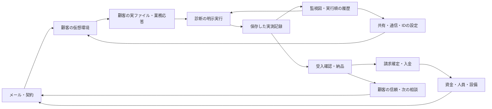

# ソフトの見分け方と、実際の仕事をつなぐ監視

2026-10-05。既存作業ブランチを最新化した上で、機材の準備・納品サイクルに続いて、共有案件の受注から入金までをネイティブ画面で操作した。今回の実装単位はサービス監視。全ソフトの再設計が完了したという記録ではない。

## 実画面から選んだ問題

1. **受注・メール：進行可能。** 東雲会計事務所の「取引先資料を閲覧専用にする」を営業画面から受注。社員の編集継続、取引先の閲覧、7日間の期限、認証をメールで確認できた。
2. **接続・共有設定：進行可能。** SSH接続後、Nextcloudで実ファイルとスタッフ・パートナー・公開リンクの権限が見える。変更対象を選べる。
3. **修正前の診断：問題を実測できた。** 取引先のPUTがHTTP 200で許可され、受入診断は不合格。返す内容は同じCSVだったが、更新操作自体が通ることが業務条件に反する。
4. **旧サービス管理：重大な情報の不足。** この時も緑の「稼働中」。応答は文字ログに埋まり、どの受入条件が破れているか、何を再測定すべきかが分からない。これを今回の優先対象とした。
5. **新監視→修正→再測定：操作を確認。** 不合格の実線から同じ診断を開ける。共有を「閲覧のみ」へ保存すると破線の古い測定へ変わり、再測定した403応答で合格になる。社員・取引先の閲覧、MFA未完了の拒否、公開URL拒否、期限、監査記録も個別に実測した。
6. **納品・入金：結果が残った。** 16/16の受入確認、納品、INV/0003確定・入金まで操作。信用143→191、満足度70→75、会社Lv5→6。売上¥5,421、経費¥700、利益¥4,721、現金¥19,384→¥24,105。

1〜4の保存画像はローカル `artifacts/github-publication/audit/software-ecosystem-20261005/01〜15`、5〜6は `16〜22`。納品済み案件のブラウザでは編集画面を再調査できなかったため、新たな未完了案件を通常の営業から受注した。3Dオフィス起動時の黒い画面も1回再発し、Alt入力で描画が復帰した。起動原因・修正済みとは扱わない。

## 各ソフトの役割と造形

色は所属や操作の入口、図形・配置は仕事の対象、記号と文字は結果を伝える。似た機能は同じ系列として扱い、別の仕事では選択対象と操作の並びを変える。既存コードの専用画面を生かして段階的に改善する。

| ソフト | 画面と操作の主役 | 見分け方・配置 | 他のソフトへ渡るもの | 今回の確認範囲 |
|---|---|---|---|---|
| Outwatch | 顧客と会話・添付資料 | 青いメールバー、フォルダー→件名→本文 | 契約・依頼条件・顧客の反応 | ネイティブ確認 |
| ファイル | 実ファイルと保存先 | フォルダー、階層・パス・ファイル選択 | エディタの原文、共有元CSV | ソース確認・既存画面を継続 |
| エディタ | 下書きと保存した構成 | 文書タブ・行番号・コード領域、保存操作 | 同じVMのディスク構成 | ソース確認・既存画面を継続 |
| ターミナル | 接続先とコマンド応答 | 黒い端末、ホストのプロンプト、時系列の応答 | 実VMの接続・操作・観測 | ネイティブ接続確認 |
| サービス監視 | 保存された測定と対象の関係 | 紺色、サーバー図形→測定対象、実行順の履歴図 | 同じIDの診断・サービス制御へ移動 | 今回実装・ネイティブ確認 |
| 診断ラボ | 利用主体・要求・期待と応答 | 紫、検査選択→実行→応答比較 | 実測記録、受入判定 | ネイティブ9項目・保存失敗テスト |
| Samba | 共有・利用者・ACL | グレーの管理枠、共有と利用者の関係図 | 実共有ファイル・読取と書込の応答 | ソース確認・既存画面を継続 |
| Backrest | 保存世代・実内容・復元先 | 黒と緑、世代選択、ファイルと復元作業領域 | 復元した実データ、業務の回復 | ソース確認・既存画面を継続 |
| pfSense | 順序付き通信ルール | 黒いナビ、接続条件の行と一致経路 | 業務URLの到達性・診断応答 | 通常案件をネイティブ入力で修正・納品 |
| ID管理 | 利用者と発行済みセッション | 暗い左ナビ、アカウントと接続の別領域 | ログイン結果・共有サービスの認証 | ソース確認・既存画面を継続 |
| 端末管理 | 端末・プロセス・隔離状態 | 明るい端末一覧と選んだ端末の詳細 | 隔離・解除後の業務アクセス | ソース確認・既存画面を継続 |
| Nextcloud | ファイル・受信者・権限 | 青緑、ファイル面と右の共有パネル | 同じCSV、権限、期限、版履歴 | ネイティブ修正・再開確認 |
| 顧客・受注・台帳 | 顧客の業務データ | 紫の業務ナビ、レコード・取引・残高 | 共有元CSVと業務応答 | ソース確認・関連回帰テスト |
| 請求管理 | 請求書と入金 | 紫、紙面の請求書、金額、下書き→確定→入金 | 会社の現金と保存済み取引履歴 | ネイティブ入金確認 |
| 納品・精算 | 提出前の実測と顧客の評価 | 受入チェック、顧客結果と収支の切替 | 請求書・信用・次の相談 | ネイティブ確認 |
| チーム・会社管理 | 担当者・設備・営業日 | 人員・配置、機材、見積、日次資金を目的別に配置 | 作業時間・費用・受注条件 | 前サイクルの機材準備と今回の受注確認 |
| リファレンス | 必要な補足 | 作業目的・設定・コマンドの索引 | 自分で選ぶ操作への手掛かり | 既存画面を継続 |
| 専門案件 | 調査対象と証拠・実験条件 | 9系統の固有作業面。内容は `all-services-workspaces.md` | 証拠・操作の影響・保存済み受入結果 | 今回の個別ネイティブ検証対象外 |

Nextcloud、Backrest、pfSense、業務・請求のOdoo型画面などの既存参照を維持する。新監視は [Zabbixの監視マップ](https://www.zabbix.com/documentation/current/en/manual/web_interface/frontend_sections/monitoring/maps) の対象と状態を結ぶ配置を参考にした。描く線は受入測定との関係であり、物理配線やパケットの実流量とは扱わない。実製品全体を再現するものではない。



## 実装と達成条件

- プロセス稼働と受入の合否を分ける。対象ボタンと接続線が、○未測定・×不合格・✓合格・↻古い測定を記号と文字でも示す。連携元が保存されておらず現在性を確認できない時は「？現在性不明」。
- 対象を選び「選択した対象を診断」で同じIDの診断へ移る。移動・更新・描画で検査を実行しない。制御と実ソフトの設定は既存の操作を使う。
- 履歴は実際の観測順。新しい記録にだけ実測時の判定と期待を保存。旧記録の判定は不明のままにして、CPUや時刻の架空データを生成しない。
- `service_monitor_snapshot()` はライブVMか保存済みVMを独立したコピーで読む。未作成・壊れた保存は不明。表示用にGameのVMを初期生成しない。旧制御・構成・ログもこのコピーを読む。デスクトップ全体の他の既存描画経路まで純粋化したとは扱わない。
- 測定の保存失敗はVM・履歴・作業時間・現金・割当を操作前へ戻す。画面には今回の失敗と保存済みの前回結果を分けて表示する。保存先が復旧した後の再試行で新しい結果を確定する。
- セーブに任意の `monitor_ui` を追加。タブと選んだ測定対象を再開時に復元する。既存の構成・記録・契約を置き換えない。

## 検証と限界

`test_service_monitor_snapshot.gd` は44確認、失敗0。未作成・ライブ・保存済み・戻り値の独立性、実失敗→未適用→適用→再測定、実測時の履歴、保存失敗の巻き戻し、連携元がない場合、壊れた保存、共有元とローカル複製の実内容が異なる場合を確認。テストの専用状態は合成フィクスチャであり、通常資金でのプレイ証拠とは区別する。

`test_service_apps.gd` は既存の制御・再起動失敗と再試行、ログ検索に加え、前回PASSがある診断の保存失敗表示と復旧後の再試行を確認。SoftwareFidelity、PortalVersions、StoryFirewallProbes（21確認）、SaveExitSafetyはPASS。

`test_service_monitor_ui.gd` は通常資金の初日案件を公開APIで受注・資料確認する準備後、接続・測定・実設定・再測定・納品をGodotのマウス／キー入力で操作。背景時計のみ停止し、操作による作業時間は残す。途中の保存・再読み込みはAPI。実際に手動受注して保存した共有案件のコピーも、9対象の配置と最後の対象からの診断遷移を確認するために使う。この追加チェックは9項目の再プレイ全体とは区別する。

最終ネイティブ入力の画像・JSON・ログはローカル監査フォルダーの `wide-final`（1920×1080・100%）と `narrow-final`（960×600・130%）。スクロールして履歴全体・サンプル番号を確認し、主要な診断導線はShift+Tab／Enterでも操作した。9対象の画面はスクロールが必要。PNGは元のゲーム出力で、加工していない。初回の重なりは修正し、配置の境界チェックも追加した。

両寸法で239確認／失敗0、31クリック・7キー入力。縦スクロールは大画面4回、小画面12回。既知の操作を自動で行った数であり、人が初見で必要とする操作数や時間ではない。共有サービスの構成欄でも実ファイル名・サイズと表示の一致を確認した。

```text
Godot --headless --path game --script res://tests/test_service_monitor_snapshot.gd -- --qa-profile=monitor-engine
Godot --path game --script res://tests/test_service_monitor_ui.gd -- --qa-profile=service-monitor-ui --narrow
```

通常のUI試験は初日案件のサイクルを実行する。出力先は `WHL_CAPTURE_DIR`、追加の途中案件のコピー元は任意の `WHL_MONITOR_NINE_FIXTURE`。後者を使う時は今回の手動QA保存を指定する。コピー元の内容は保持し、書き込み先は必ずQA保存先に限定する。

2026-09-21更新の既存プレイヤーセーブをQAへ複製し、現コードで読み込み→保存→再開は33確認／失敗0。元ファイルのSHA-256は前後とも `9ceabc887485dc835df3dec6e89b75c96a600025b54b4090d5b422e062c110f8`。今回の途中案件の旧セッションも図の初期表示と診断遷移を確認する。

開発者の操作と既知のコントロールを使う自動入力であり、初見プレイヤーの理解・面白さ、全ソフト・全案件の手動検証、完全なアクセシビリティを証明していない。未完了の診断総合テストはPASS根拠に含めない。起動の黒画面は未解決。

次は、同じ共有案件の変更を顧客側のCSV編集・版履歴・会計業務の操作でも比較し、サービスごとの造形だけでなく業務上の影響が連続して読めるかを優先してプレイする。今回の9対象は縦スクロールが必要なので、測定対象を業務の利用者・操作へまとめる案もその実プレイ結果から選ぶ。
